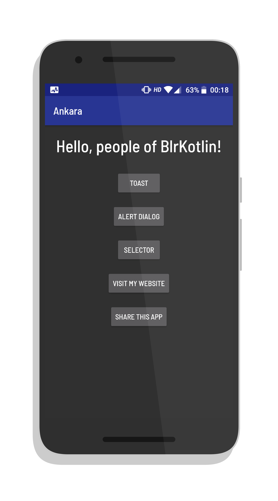

#  Ankara

An example app to demo the usage of Anko in my Kotlin talk at BlrKotlin's 3rd Meetup.
  

 
## Developer

<h3>Bapusaheb Patil</h3>

<a href="https://bapspatil.com">Website</a>&emsp;<a href="https://linkedin.com/in/bapspatil">LinkedIn</a>&emsp;<a href="https://bit.do/bapsapps">Play Store</a>&emsp;<a href="https://bit.do/bapswat">Watchfaces</a>&emsp;<a href="https://twitter.com/baps_patil">Twitter</a>